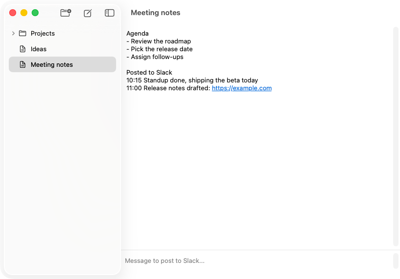
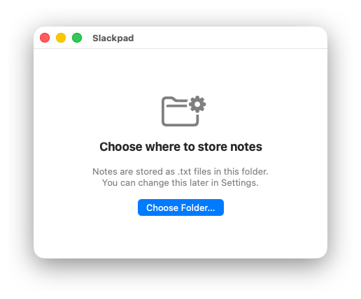
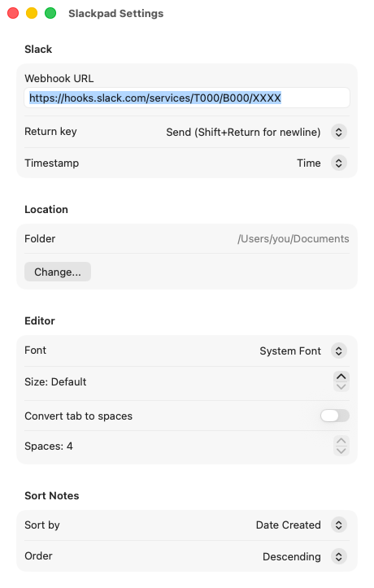

# Slackpad

Slackpad is a macOS note taking app that keeps your notes as plain .txt
files and posts to Slack as you write.

Notes live in a folder you choose. The sidebar shows that folder as a tree.
Editing saves automatically. The window title shows the open note's name, and
you rename a note from the sidebar. Below the editor there is a Slack input.
When you send a
message it goes to a Slack Incoming Webhook and is also appended to the
current note with a timestamp, so the note keeps a record of what you
posted.

## Setup

On first launch Slackpad asks for a folder to store notes in. The default
is your Documents folder. Open Settings (Cmd+,) and paste a Slack Incoming
Webhook URL. Without it you can still take notes, but posting is off. You
can create a webhook at https://api.slack.com/messaging/webhooks. The URL
must use https.

## Usage

Cmd+N creates a note and Cmd+Shift+N creates a folder. A new note opens with
its name ready to type in the sidebar. Type in the editor and it saves as you
go. Rename a note later by selecting its row and pressing Return, or right
click a row in the sidebar. Drag notes and folders in the sidebar to move
them, or right click a row for rename, new note, new folder, and move to
trash.

Write a message in the Slack field and press Return to send. The message is
posted to Slack and appended to the note. To post without appending, select
text in the editor, right click, and choose Post Selection to Slack. Cmd+L
moves focus between the editor and the Slack field.

## Settings

The webhook URL, whether Return sends or inserts a newline, the timestamp
added to posts (time, date and time, or none), the editor font, and the
sidebar sort order.

## Files

Notes are stored as .txt files that mirror the sidebar tree, so you can
open, edit, and back them up with any other tool. Slackpad watches the
folder and reflects changes made outside the app.

## Screenshots

First launch asks where to store notes.

Settings hold the webhook and post options.

